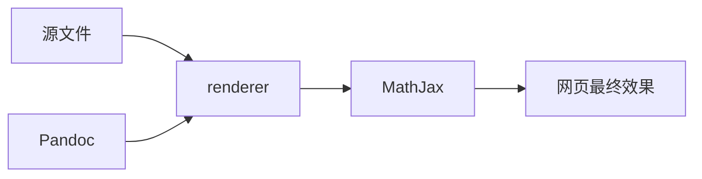

记录一下笔者的电脑上安装的 Pandoc 报错的问题，以及对应的解决方案。

<!-- more -->

# 背景
0. 笔者动手能力很差，而且刚接触 Ubuntu 系统不久，对其并不熟悉；
1. 笔者搭建博客的其中一个重要目的就是记录笔记，而笔者本身又是理工专业的，所以博文中必然包含大量的数学公式，这些数学公式的输入与排版几乎只能依赖于 LaTeX / MathJax
2. 基于 Hexo 框架以及 Next 主题自身的某些原因，MathJax虽然已经内置在 Next 主题中，但是据网上的反映，Hexo 的渲染引擎在渲染某些 LaTeX 代码的时候，会错误地解析成别的东西，最后呈现出来的方式是一团乱麻；
3. 所以，笔者在搭建博客的时候，花了许多的心思寻找解决方案：
    1. 有些网友的方法是修改 Hexo 框架的某些解析规则；笔者不喜欢这种需要修改框架自身的方法；
    2. 有些网友提出更换 Hexo 原有的渲染引擎，但更换之后仍会有这些问题出现，从而仍然需要修改 Hexo 框架的规则；
    3. 还有一种方法就是使用 Pandoc 渲染，据网上的资料，这种方法需要在本地安装 Pandoc，可能稍显臃肿；但无需修改任何规则，直接可用，另外 Pandoc 解析的 Markdown 的语法格式和 标准你 Markdown 有一定的不一样（**比如 LaTeX 的 $ ... $ 两边必须紧贴公式，不能留空**）

4. 使用 Pandoc 渲染的安装步骤比较简单（此处顺便作为搭建记录）
    1. 本地安装最新版本的 Pandoc；
    2. Hexo 博客根目录下终端安装 `hexo-renderer-pandoc`；
    3. 卸载原有的渲染引擎；
    4. 在 Next 主题配置文件 `_config.yml` 中 将 `enable:MathJax` 项设为 `true`
    
5. 笔者**猜测**的针对数学公式渲染的流程：


渲染引擎应该需要调用本地的 Pandoc 程序；
而 MathJax 本身应该是独立的，因为官方的原版渲染引擎也能显示一部分公式，但它要求前面的解析工作不能出问题；

6. 在配置完成之后，博客框架可以正常运行

# 错误描述

3 月 13 日，笔者发觉已经有一段时间没有写博文了，于是就随意写了一些，在终端下生成博客的时候，竟然破天荒的报错了：

```
pandoc exited with code 2: --smart/-S has been removed.  Use +smart or -smart extension instead.
```

# 解决过程
## 反思和复盘：

1. 笔者最近并没有折腾过电脑上的 Hexo 框架，问题是平白无故地出现的；
2. 之前在笔者的 Windows 10 系统上，也曾出现过这样的问题，并且最后死活都解决不了，后来重装了 Ubuntu 后不了了之；
3. 这次问题的出现的原因应该和之前是类似的；
4. 上一次正常写博文大约是在十天前，这十天内可能导致错误的出现的可能原因有：
    1. 笔者更换了 Markdown 文件的编辑器，新的编辑器在本地直接使用 pandoc 渲染；
    2. 还安装了一些打包好的 AppImage 程序；

## 解决过程

1. 根据报错信息在 Google 上搜索，大意就是 Pandoc 的版本低于 2.0 就会出现这种错误；
2. github 上有网友表示在重装了 hexo-renderer-pandoc 之后就成功解决了问题；
3. 当时笔者终于回想起在 Win 10 上遇到的问题应该是同一个问题；

4. 但首先为了排除是 Markdown 源文件的问题，笔者现将最近的两篇博文的 Markdown 源文件移到别的目录下

    重新生成： `hexo -g`，依然报错；

    此时可基本排除 Markdown 源文件的问题；
5. 笔者直接在终端下输入命令 `pandoc -v`，显示版本号是 1.9
    
    问题逐渐浮出水面，当时笔者安装 pandoc 的具体版本是多少虽然不记得了，但绝对不可能去安装一个这么低的版本；

6. 终端输入 `dpkg -l | grep "pandoc"`，显示 pandoc 版本是 2.5

    看来应该是不小心在电脑上安装了两个 pandoc，引起了混乱；

7. 笔者怀疑是新的编辑器 VSCode 以及插件 Markdown-Preview-Enhanced 引入了新的渲染引擎，可是在设置中并没有证据显示这一点；

8. 求助于搜索引擎，换了许多关键字，无果；最终把搜索关键字换为英文在 Google 上搜到了一个网页：

    [Issues installing pandoc 2.3.1 in Ubuntu 18.04.1](https://askubuntu.com/questions/1084723/issues-installing-pandoc-2-3-1-in-ubuntu-18-04-1)

    里面的评论提醒了笔者，这种情况下很可能是因为另外一个 pandoc 是通过 non-deb 的方式安装的，所以需要将这个 “私生子” 给找出来

9. 此外，笔者还了解到了两个有用的命令：`whereis` 和 `which`，最终通过这两个命令找到了多出来的 pandoc，其实是在 anaconda 的 base 环境下的可执行文件；


10. 真相终于大白！接下来就是解决这个问题的步骤了：

    1. 笔者首先试图升级 anaconda 环境下的 pandoc 包，但好像没办法升级；
    2. 最后，笔者把 anaconda 在 PATH 环境变量中的顺序改到最后：这样系统按照从前到后的搜索顺序就会先搜索到系统安装的 pandoc了

11. 最终问题解决，博客可以正常生成了！解决了之前悬而未决的问题，颇有收获。


