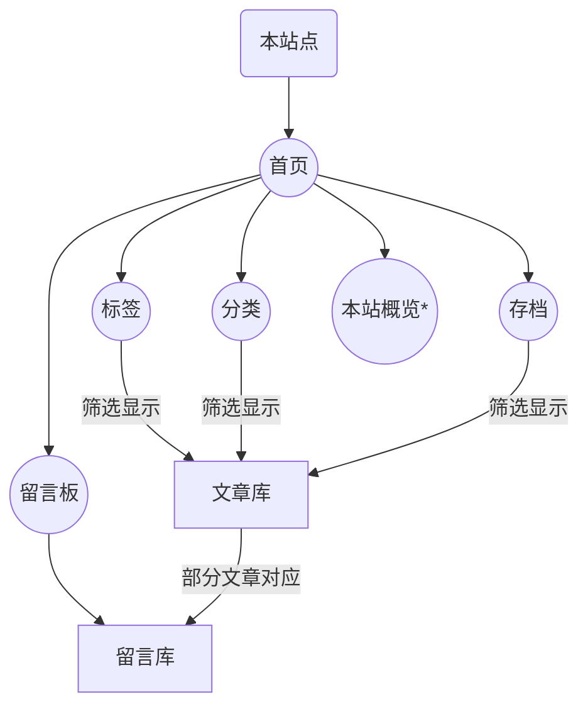
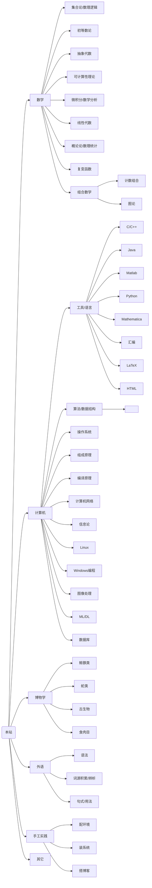

#### 地图

#### 1. 站点地图

我的博客页面组织架构如下所示：

```mermaid
graph TB
    id1(本站点)-->id2((首页))
    id2-->id3((标签))
    id2-->id4((分类))
    id2-->id5((存档))
    id2-->id6((本站概览*))
    id2-->id7((留言板))
    id3--筛选显示-->id8[文章库]
    id4--筛选显示-->id8[文章库]
    id5--筛选显示-->id8[文章库]
    id7-->id9[留言库]
    id8--部分文章对应-->id9
```

#### 2. 内容组织

在本博客中, 博文一般根据其主题内容按照树状结构组织.

如果某一篇博文涉及到不同的领域, 其最核心的主题将作为其分类根据, 其他主题使用 "标签" 的形式补充.

```mermaid
graph LR
    id1(本站)-->id2[数学]
    id1(本站)-->id3[计算机]
    id1(本站)-->id4[博物学]
    id1(本站)-->id5[外语]
    id1(本站)-->id6[手工实践]
    id1(本站)-->id7[其它]
    
    id2-->id21[集合论/数理逻辑]
    id2-->id22[初等数论]
    id2-->id23[抽象代数]
    id2-->id24[可计算性理论]
    id2-->id25[微积分/数学分析]
    id2-->id26[线性代数]
    id2-->id27[概论论/数理统计]
    id2-->id28[复变函数]
    id2-->id20[组合数学] 
    
    id20-->id200[计数组合]
    id20-->id201[图论]
       
    id3-->id41[工具/语言]
    id3-->id30[算法/数据结构]
    id3-->id31[操作系统]
    id3-->id32[组成原理]
    id3-->id33[编译原理]
    id3-->id34[计算机网络]
    id3-->id35[信息论]
    id3-->id36[Linux]
    id3-->id37[Windows编程]
    id3-->id38[图像处理]
    id3-->id39[ML/DL]
    id3-->id40[数据库]
    
    id30-->id300[ ]
    
    id41-->id410[C/C++]
    id41-->id411[Java]
    id41-->id412[Matlab]
    id41-->id413[Python]
    id41-->id414[Mathematica]
    id41-->id415[汇编]
    id41-->id416[LaTeX]
    id41-->id417[HTML]
    
    id4-->id42[鲸豚类]
    id4-->id43[蛇类]
    id4-->id44[古生物]
    id4-->id45[食肉目]
    
    id5-->id50[语法]
    id5-->id51[词源积累/辨析]
    id5-->id52[句式/用法]
    
    id6-->配环境
    id6-->装系统
    id6-->搭博客
    
```

